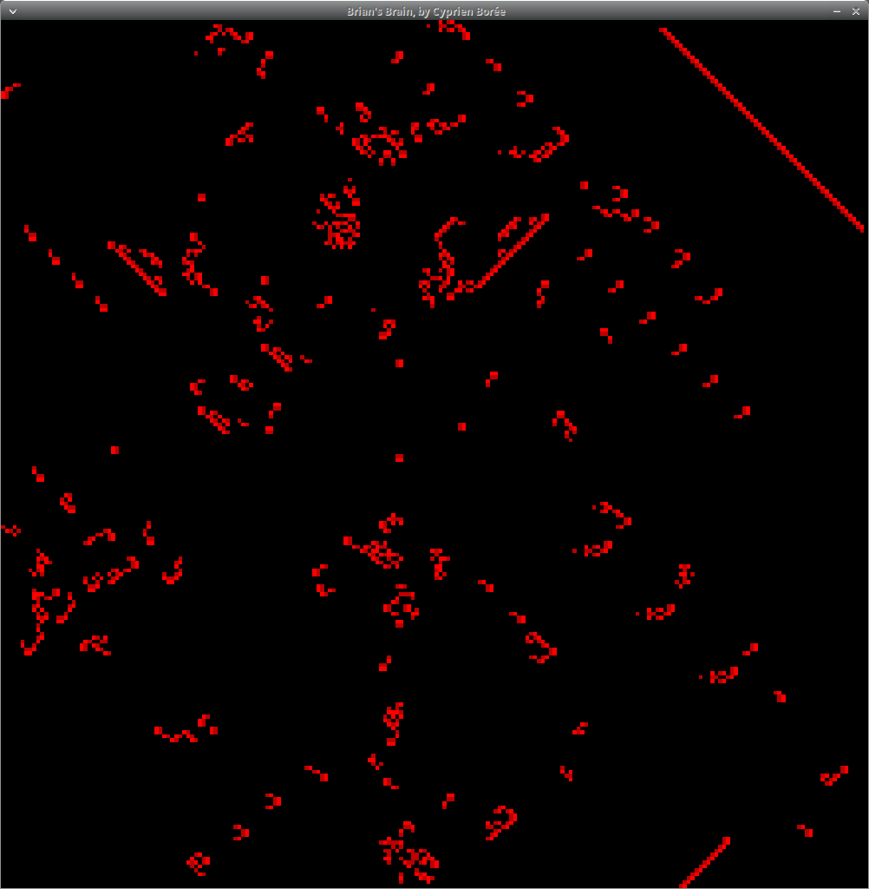
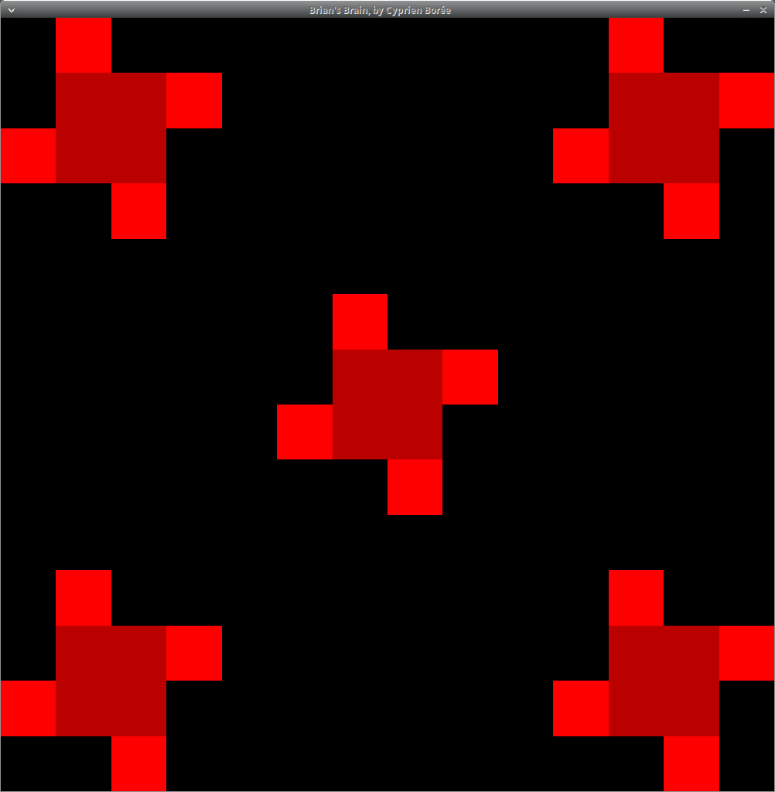
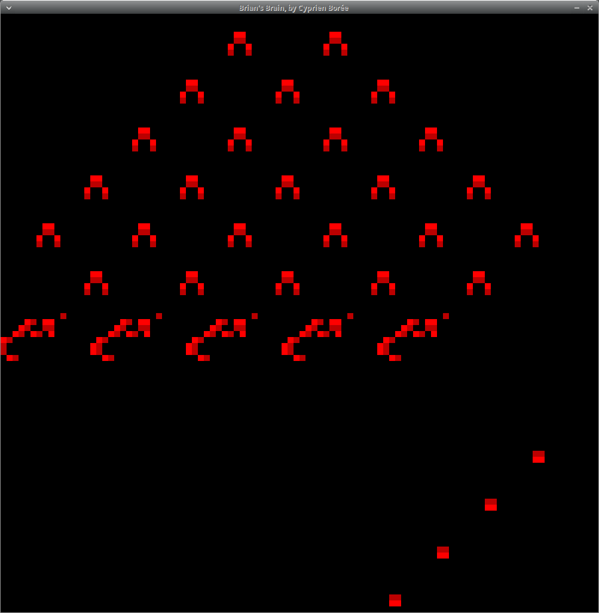
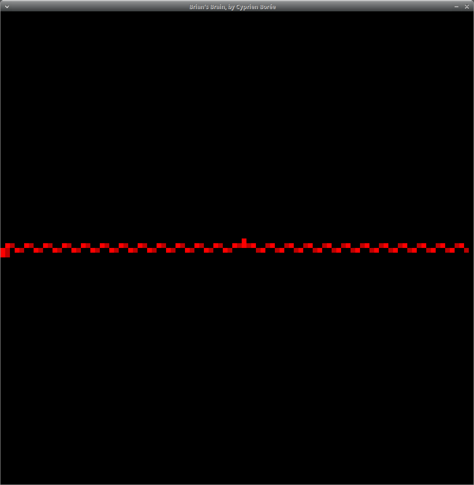

# Brian's brain (by Cyprien Borée)

This project is an implementation of the cellular automaton called 
[Brian's Brain](https://en.wikipedia.org/wiki/Brian%27s_Brain). It was made  with 
[Rust](https://en.wikipedia.org/wiki/Rust_(programming_language)) and 
[Vulkan](https://en.wikipedia.org/wiki/Vulkan)'s' graphics API.

# Images






# User manual

## Compilation

First of all, rust language has to be installed (see [here](https://www.rust-lang.org/tools/install)).

The program can be run in a GUI (a CLI version exists), in order to do so, Vulkan API has to be 
installed on the system (if `vkcube` test program can be executed, it's good).

Additionally, basic packages (`build-essential`, `cmake`) and other languages packages (`g++`, `python3`)
are required by dependencies for a complete compilation.

Finally, the program can be built with `cargo`.
```console
user:~$ cargo build --release 
```

## Execution

When it's compiled properly, the executable will be placed into `target/release/`.

There are two ways to execute it. The first one is by simply using its path:

```console
user:~$ ./target/release/brian-s-brain
```

The other way is to use `cargo`:

```console
user:-$ cargo run
```

### Arguments

Note that to provide arguments through `cargo run`, they have to be separated with `--`.

The executable can be provided with arguments (see them with `--help` or `-h`) :

```console
user:-$ cargo run -- --help
program to run the Brian's Brain cellular automaton

Usage: brian-s-brain [OPTIONS]

Options:
  -b, --benchmark
          Do 100 runs of the program and for each of them:
          
          1. Declare the size of the cellular automaton to be 100x100 (`WorldState::new()`)
          2. Initialize the world with 50% random noise (`WorldState::randomize()`)
          3. Do 100 iterations (`WorldState::next()`)
          
          Then, the average execution time for each call is displayed.

      --cli
          Run the program in the terminal. Note that if the cellular automaton's environment is too huge, render may fail

      --example <EXAMPLE>
          Run the program with a specific start.
          
          - `--example=1` depicts 5 period-3 oscillators.
          - `--example=2` depicts gliders creating a breeder.
          - `--example=3` depicts a wick.
          
          [default: 0]

  -f, --framerate <FRAMERATE>
          The number of time between two frames (in milliseconds). if the value is not specified, the display rate will be as fast as possible
          
          [default: 0]

  -g, --gui
          Run the program with a graphical user interface. This is the default mode if no other viewing modes is selected

  -i, --iter <ITER>
          The number of iterations to run for
          
          [default: 100]

  -r, --randomness <RANDOMNESS>
          The percentage of cell alive at the beginning. The cells are chosen randomly
          
          [default: 0.5]

  -s, --size <SIZE>
          The size of the world in which the cells live
          
          [default: 10]

  -h, --help
          Print help information (use `-h` for a summary)

  -V, --version
          Print version information
```
#### Examples

Initialize a world 100x100, with 3% alive cells and run it in the terminal 
for 100 iterations:

```console
user:~$ cargo run --release -- --cli --iter=100 --size=100 --randomness=0.03
```

Initialize a world 50x50, with 60% alive cells and run in a GUI for 1000 iterations:

```console
user:~$ cargo run --release -- --gui --iter=1000 --size=50 --randomness=0.6
```

Run the examples

```console
user:~$ cargo run --release -- --example=1
user:~$ cargo run --release -- --example=2
user:~$ cargo run --release -- --example=3
```
        

# Programmer manual

## Documentation

The documentation can be generated with `cargo`:

```console
user:~$ cargo doc
```

The generated files will be placed in `target/doc/brian_s_brain` and the entry point is accessed by `index.html`.

To view the file, `cargo` can use the default web browser on the system with:

```console
user:~$ cargo doc --open
```

## Unit Tests

I wrote unit tests to assert the good behaviour of the cellular automaton (represented by `WorldState` struct). 
`cargo` can run the tests as follows:

```console
user:~$ cargo test --release
```

## Benchmark

Use `--benchmark` to check the time taken by the main functions:

```console
user:~$ cargo run --release -- --benchmark
Benchmark - 100 runs average
WorldState::new()        	275ns
WorldState::randomize()  	111.924µs
WorldState::next() (x100)	20.23769ms
total:                   	20.349889ms
```